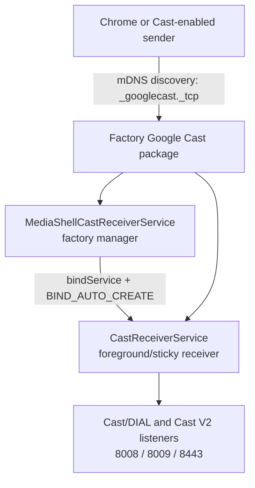

# TCL QM8 Google TV: Search and Chromecast Repair

This repository documents a successful, live repair of two failures on a 2024 TCL QM8-series Google TV:

1. **Google Play Store search did nothing** — selecting **Search for apps and games** opened no keyboard and produced no visible response.
2. **Google Cast / Chromecast was missing and undiscoverable** — Chrome could not find the TV for tab or desktop mirroring, the Cast system app did not appear in Settings, and its Play Store page produced a generic installation error.

The final result was:

- Play Store search and its on-screen keyboard worked again.
- The factory Google Cast receiver became visible on the LAN.
- Chrome discovered the TV without keeping a diagnostic page open.
- **Chrome → Sources → Cast screen** displayed the Windows desktop on the TV.
- No factory reset, rooting, bootloader unlock, OEM unlock, picture-mode reset, firewall change, or permanent third-party TV service was used.

> [!IMPORTANT]
> Start with the low-risk sections. The search fix and factory Cast service wake-up are straightforward. The hidden-package repair is an advanced, firmware-specific procedure and must not be copied onto a different build merely because the television has a similar product name.

## Contents

- [What was tested](#what-was-tested)
- [Symptoms and final diagnosis](#symptoms-and-final-diagnosis)
- [Safety and scope](#safety-and-scope)
- [The shortest safe repair path](#the-shortest-safe-repair-path)
- [Fix 1: restore Play Store search](#fix-1-restore-play-store-search)
- [Set up wireless ADB on this TCL TV](#set-up-wireless-adb-on-this-tcl-tv)
- [Read-only Chromecast diagnosis](#read-only-chromecast-diagnosis)
- [Fix 2A: wake the intact factory Cast services](#fix-2a-wake-the-intact-factory-cast-services)
- [Fix 2B: repair the hidden Cast package state](#fix-2b-repair-the-hidden-cast-package-state)
- [Why the keep-alive service mattered](#why-the-keep-alive-service-mattered)
- [Test with the official Cast Web Sender SDK](#test-with-the-official-cast-web-sender-sdk)
- [Cast the full Windows desktop](#cast-the-full-windows-desktop)
- [How the successful investigation unfolded](#how-the-successful-investigation-unfolded)
- [Programs and tools used](#programs-and-tools-used)
- [What did not fix it](#what-did-not-fix-it)
- [Durability, reboot behavior, and recovery](#durability-reboot-behavior-and-recovery)
- [Security cleanup](#security-cleanup)
- [Troubleshooting decision table](#troubleshooting-decision-table)
- [Technical evidence](#technical-evidence)
- [FAQ](#faq)
- [Official references](#official-references)

## What was tested

| Item | Tested value |
|---|---|
| Retail model | [TCL 75-inch QM8-Series QD-Mini LED Google TV (2024)](https://www.bestbuy.com/product/tcl-75-class-qm8-series-4k-uhd-hdr-qd-mini-led-smart-google-tv-2024/J36QYTWK89) |
| TCL model family | 75QM851G / 2024 QM8 |
| Android-reported model | `Smart TV Pro` |
| Device platform | `G08` |
| TCL firmware | `V8-T653T02-LF1V321` |
| Operating system | Android TV / Google TV 14, API 34 |
| Security patch | `2025-12-05` |
| Build | `UTT2.250416.001`, incremental `AU14` |
| Factory Cast package | `com.google.android.apps.mediashell` |
| Factory Cast version | `3.72.446070` (`versionCode=446070212`) |
| Factory Cast APK | `/product/priv-app/AndroidMediaShell/AndroidMediaShell.apk` |
| Factory Cast APK SHA-256 | `6AEE5E47A48518BADFB52DF68AA343E3571AEFBBD8A4CF5D176676D64AE5D303` |
| Google TV search package | `com.google.android.katniss` |
| Working factory search version | `7.38.14+806274746.03` (`versionCode=15018661`) |
| ADB used on Windows | Android SDK Platform Tools `35.0.2-12147458` |
| Chrome used for final test | `150.0.7871.182` |

The package-state repair below is documented for that exact combination. A later TCL firmware or Cast package may have different package-manager behavior, service names, binder signatures, version codes, or APK hashes.

## Symptoms and final diagnosis

### Play Store search

Observed behavior:

- **Apps only mode was off.**
- The Play Store itself opened and could be navigated.
- Selecting **Search for apps and games** did nothing.
- No on-screen keyboard appeared.
- Restarting and clearing cache/data did not repair the search action.

Diagnosis:

- The updated **Google app for Android TV**, package `com.google.android.katniss`, was malfunctioning on this firmware.
- Rolling that one app back to the factory version restored the search interface and keyboard immediately.

### Google Cast / Chromecast

Observed behavior:

- The TV was absent from Chrome's Cast receiver list.
- “Google Cast” or “Chromecast built-in” was absent even under **Show system apps**.
- The Play Store offered **Install**, but the attempt ended in a generic error.
- YouTube could sometimes prompt to connect and cast successfully.
- Clearing the Cast app's cache/data, restarting, and a 60-second power removal did not make normal Cast discovery durable.

Diagnosis:

1. The Cast APK still existed in the read-only factory `/product` partition.
2. Android Package Manager recorded the app for TV user 0 as:

   ```text
   installed=true hidden=true
   ```

3. `hidden=true` explained why the app was absent from Settings and ordinary package lists even though its APK was physically present.
4. The factory Cast receiver could be started, but it initially went idle again because its built-in manager service was not holding the receiver service alive.
5. YouTube was a misleading test. Google explicitly warns that YouTube and Netflix use specialized discovery mechanisms and should not be used to validate normal Cast discovery.

The repaired state became:

```text
installed=true hidden=false stopped=false notLaunched=false
```

The manager service then held the receiver service through Android's normal service binding, `_googlecast._tcp` remained advertised, and Chrome could discover the TV after the diagnostic SDK page was closed.

## Safety and scope

### What these actions do not change

The successful procedure did **not** alter:

- Picture mode, brightness, contrast, color calibration, motion settings, HDR/Dolby Vision profiles, HDMI input settings, or other display calibration.
- The bootloader, verified boot, recovery image, system image, or `/product` image.
- OEM unlocking.
- Bluetooth HCI snoop logging.
- Wi-Fi verbose logging.
- Windows Firewall rules.
- Router configuration.

The TV briefly showed a blank gray screen when the factory Cast settings activity was launched. That was the Cast app's nearly empty settings activity, not a display reset. Pressing **Back** returned to the normal TV interface.

### Risk levels

| Level | Actions |
|---|---|
| Read-only | `getprop`, `pm list`, `dumpsys`, `logcat`, `pidof`, `ss`, mDNS browsing, hashing a pulled APK |
| Low | Roll back one Google TV app update, start an existing factory service, launch the factory Cast settings activity, restart the TV |
| Medium | Clear app cache/data; this can reset that app's own local state but not picture calibration |
| Advanced | Change the Cast system app's per-user package state through the guarded helper |
| Not used | Root, OEM unlock, bootloader unlock, factory reset, custom firmware, remounting `/system` or `/product` |

> [!CAUTION]
> Do not run the advanced helper until read-only inspection proves all of the following:
>
> - package is exactly `com.google.android.apps.mediashell`;
> - TV user is exactly user `0`;
> - Cast version code is exactly `446070212`;
> - factory APK path and SHA-256 match the table above;
> - package state is specifically `installed=true hidden=true`;
> - TV firmware is the tested TCL build;
> - normal service startup and `install-existing` were insufficient.

If any value differs, stop at diagnostics and contact TCL/Google rather than guessing.

## The shortest safe repair path

Use this order:

1. Confirm the PC and TV are on the same non-guest LAN.
2. Disable a VPN, Tailscale exit node, or other overlay network temporarily if it changes local routing.
3. Confirm automatic date/time on both devices.
4. Fix Play Store search by rolling back **Google app for Android TV**.
5. Enable developer options and pair ADB.
6. Inspect the Cast package and service state without changing anything.
7. If the package is already `hidden=false`, skip the helper and start the two factory Cast services.
8. If the package is `hidden=true` and every version/hash guard matches, use the audited helper, then immediately restore the factory package with `install-existing`.
9. Start the built-in manager service and receiver service.
10. Verify `_googlecast._tcp`, Cast ports, and Chrome discovery.
11. Cast the desktop.
12. Remove the temporary helper and disable debugging when finished.

## Fix 1: restore Play Store search

This was the cleanest fix in the entire investigation.

### TV remote procedure

Open:

```text
Settings
  → Apps
  → See all apps
  → Show system apps
  → Google app for Android TV
  → Uninstall updates
```

Confirm the rollback, return to the Play Store, and select **Search for apps and games** again.

On the repaired TV:

- the search page opened;
- the on-screen keyboard appeared;
- search accepted text again.

### Why this targeted only search

The selected application is the Google TV search app:

```text
Package: com.google.android.katniss
Working factory version: 7.38.14+806274746.03
Working factory versionCode: 15018661
```

**Uninstall updates** removes the downloaded update for that app and exposes the factory copy already included in the TV firmware. It does not uninstall the TV operating system, reset the television, or touch picture settings.

### Is it reversible?

Yes. Updating or installing **Google app for Android TV** from the Play Store puts the newer version back. If that newer build reintroduces the broken search action, roll it back again and consider disabling automatic updates for that app until TCL or Google ships a compatible update.

### Would clearing cache or data help?

It is reasonably safe for picture calibration because it targets only the selected app, but it can reset that app's own preferences, recommendations, or account-related local state. It did not solve this case. The successful action was **Uninstall updates**.

## Set up wireless ADB on this TCL TV

This TCL firmware has native **Wireless debugging**. It was found under Developer options and pairing-code ADB worked successfully.

### Install Platform Tools on Windows

Download the official [Android SDK Platform Tools](https://developer.android.com/tools/releases/platform-tools), extract them, and open PowerShell inside the `platform-tools` folder.

Verify:

```powershell
.\adb.exe version
```

The successful repair used:

```text
Android Debug Bridge version 1.0.41
Version 35.0.2-12147458
```

### Enable Developer options

Menu names vary slightly by launcher revision. On this TV the path was equivalent to:

```text
Settings
  → System
  → About
  → Android TV OS build
```

Select **Android TV OS build** seven times until the TV confirms that Developer options are enabled.

Then open:

```text
Settings
  → System
  → Developer options
```

Turn on:

- **USB debugging**
- **Wireless debugging**

> [!NOTE]
> On this exact TCL build, both toggles had to remain enabled before wireless ADB would work reliably. Android's general documentation focuses on the Wireless debugging toggle, so this is a tested TCL-specific requirement, not a universal Android rule. No USB cable was needed for the pairing-code workflow.

The following options were visible but were not required:

- Enable Bluetooth HCI snoop log
- OEM unlocking
- Wait for debugger
- Select debug app
- Logger buffer sizes
- Enable Wi-Fi verbose logging

Leave OEM unlocking off.

### Understand the two different ports

Android shows two endpoints:

1. **Pairing endpoint** — visible inside **Pair device with pairing code** and paired with the temporary six-digit code.
2. **Connection endpoint** — visible on the main Wireless debugging screen and used by `adb connect`.

They normally have different ports. Reopening the pairing dialog generates a new code and often a new pairing port.

Use placeholders in notes or screenshots; do not publish real pairing codes.

The address `192.0.2.50` below is an **example-only documentation address**. It is not the address of the repaired TV and it will not work for your TV. Read the IP address and both current ports directly from your own TV. Home-network addresses commonly begin with `192.168`, `10`, or `172.16` through `172.31`, but yours may be different.

```text
Pairing endpoint example:    192.0.2.50:37123
Temporary pairing code:     123456
Connection endpoint example: 192.0.2.50:41817
```

### Pair and connect

On the TV select:

```text
Wireless debugging
  → Pair device with pairing code
```

In PowerShell:

```powershell
# EXAMPLE ONLY: replace the IP and port with the pairing endpoint
# currently shown by your own TV.
$PairEndpoint = "192.0.2.50:37123"
.\adb.exe pair $PairEndpoint
```

Enter the six-digit code only when ADB prompts for it:

```text
Enter pairing code:
Successfully paired to 192.0.2.50:37123
```

Return to the main Wireless debugging page, read its separate IP address and connection port, then run:

```powershell
# EXAMPLE ONLY: replace the IP and port with the connection endpoint
# currently shown on your own TV's main Wireless debugging screen.
$TV = "192.0.2.50:41817"
.\adb.exe connect $TV
.\adb.exe devices -l
```

Expected:

```text
192.0.2.50:41817    device product:... model:Smart_TV_Pro device:G08
```

For the rest of the PowerShell examples, keep `$TV` set to **your own TV's actual connection endpoint**, not the example address:

```powershell
$TV = "192.0.2.50:41817" # EXAMPLE ONLY — replace this value
.\adb.exe -s $TV shell getprop ro.product.model
```

Expected model:

```text
Smart TV Pro
```

### Pairing problems

- PC and TV must be on the same LAN.
- Pairing codes expire quickly.
- The pairing port is not the normal connection port.
- If you reopened the pairing dialog, use the newly displayed values.
- Temporarily disable VPN/Tailscale routing that may intercept local traffic.
- A guest network or router AP/client isolation can block local devices from seeing one another.
- A declined Windows Firewall prompt did not cause the final fault in this case. No firewall rule was changed; Cast worked once the TV receiver stayed alive.
- If ADB says the device is offline, run `adb disconnect`, check the current TV endpoint, and reconnect.

## Read-only Chromecast diagnosis

Run these before changing package state.

### Confirm the TV build

```powershell
.\adb.exe -s $TV shell getprop ro.product.manufacturer
.\adb.exe -s $TV shell getprop ro.product.model
.\adb.exe -s $TV shell getprop ro.product.device
.\adb.exe -s $TV shell getprop ro.build.version.release
.\adb.exe -s $TV shell getprop ro.build.version.sdk
.\adb.exe -s $TV shell getprop ro.build.version.security_patch
.\adb.exe -s $TV shell getprop ro.build.display.id
```

The tested values included:

```text
TCL
Smart TV Pro
G08
14
34
2025-12-05
tcl9618-user 14 UTT2.250416.001 AU14 release-keys
```

The TCL Settings UI separately reported firmware `V8-T653T02-LF1V321`.

### Compare normal and “include uninstalled” package lists

```powershell
.\adb.exe -s $TV shell pm list packages com.google.android.apps.mediashell
.\adb.exe -s $TV shell pm list packages -u com.google.android.apps.mediashell
.\adb.exe -s $TV shell pm path com.google.android.apps.mediashell
```

In the broken state:

- the normal list and normal path lookup omitted the package;
- `pm list packages -u` still found it;
- `dumpsys package` exposed the actual per-user state.

That is why **Google Cast was not there** under Settings → Apps → Show system apps. It was not merely overlooked; Package Manager had hidden it for user 0.

### Inspect package version and user state

```powershell
.\adb.exe -s $TV shell dumpsys package com.google.android.apps.mediashell |
  Select-String "codePath=|versionCode=|versionName=|User 0:"
```

The decisive broken-state line contained:

```text
User 0: installed=true hidden=true ...
```

Also record:

```text
codePath=/product/priv-app/AndroidMediaShell
versionCode=446070212
versionName=3.72.446070
```

If your version or path differs, do not use the advanced helper.

### Pull and hash the immutable factory APK

Create a local evidence folder, then:

```powershell
.\adb.exe -s $TV pull `
  /product/priv-app/AndroidMediaShell/AndroidMediaShell.apk `
  .\AndroidMediaShell.apk

Get-FileHash -Algorithm SHA256 .\AndroidMediaShell.apk
```

Tested hash:

```text
6AEE5E47A48518BADFB52DF68AA343E3571AEFBBD8A4CF5D176676D64AE5D303
```

Pulling the APK is read-only on the TV.

### Inspect process, services, ports, and logs

```powershell
.\adb.exe -s $TV shell pidof com.google.android.apps.mediashell

.\adb.exe -s $TV shell dumpsys activity services `
  com.google.android.apps.mediashell

.\adb.exe -s $TV shell "ss -lnt | grep -E ':8008|:8009|:8443'"

.\adb.exe -s $TV logcat -d -v threadtime |
  Select-String "CastReceiver|MediaShell|googlecast|CastV2|mdns"
```

The observed Cast-related listeners after repair were:

| Port | Observed role |
|---|---|
| `8008` | Cast/DIAL HTTP endpoint |
| `8009` | Cast V2 control channel |
| `8443` | Cast HTTPS endpoint |

The exact set can vary by receiver version and state.

### Inspect normal Cast discovery from Windows

Google recommends looking for:

```text
_googlecast._tcp.local
```

If Apple's Bonjour `dns-sd.exe` is installed:

```powershell
dns-sd -B _googlecast._tcp local.
```

Press `Ctrl+C` after observing the results.

Before repair, no general Google Cast service was advertised. Android TV remote discovery could still exist, which proved that basic mDNS networking was not completely broken. After repair, the TV consistently advertised its friendly name under `_googlecast._tcp`.

## Fix 2A: wake the intact factory Cast services

Try this before the hidden-package helper.

### Condition

Use this section if:

- `com.google.android.apps.mediashell` is installed for user 0;
- `hidden=false`;
- the version/path look sane;
- but Chrome still cannot discover the TV.

### Clear a stopped/not-launched state

Launch only the factory Cast settings activity:

```powershell
.\adb.exe -s $TV shell am start --user 0 `
  -a com.google.android.settings.CAST_RECEIVER_SETTINGS `
  -n com.google.android.apps.mediashell/.settings.CastSettingsActivity
```

The screen may be blank or gray. Press **Back** once. This does not enter or reset display calibration.

### Start the built-in manager and receiver

```powershell
.\adb.exe -s $TV shell am start-service --user 0 `
  -n com.google.android.apps.mediashell/.MediaShellCastReceiverService

.\adb.exe -s $TV shell am start-service --user 0 `
  -a com.google.cast.action.BIND `
  -n com.google.android.apps.mediashell/.CastReceiverService
```

Wait 10–20 seconds, then repeat the process/port/mDNS checks.

Expected results include:

- a MediaShell manager process;
- a Cast receiver process;
- receiver service with `startRequested=true`;
- a live service binding;
- Cast listeners on `8008`, `8009`, and/or `8443`;
- `_googlecast._tcp` advertising the TV;
- Chrome showing the television in its Cast picker.

If this works, **stop here**. Do not use the advanced helper.

## Fix 2B: repair the hidden Cast package state

This section records the exact advanced repair used on the tested TV.

### Why ordinary package commands failed

The intuitive command was:

```powershell
.\adb.exe -s $TV shell pm uninstall --user 0 `
  com.google.android.apps.mediashell
```

It returned:

```text
Failure [not installed for 0]
```

That contradicted `dumpsys`, which showed `installed=true hidden=true`.

Inspection of the Android/TCL package path indicated that the shell command first performed a visibility-filtered package lookup. Because the package was hidden from the shell's normal view, the convenience command refused before it could normalize the per-user state.

### Why decompilation was used

The exact factory APK was pulled and decompiled with JADX. This established that:

- `AutoStartListener` handles boot/package-replaced events.
- `CastShellBootstrapService` starts the receiver after the system clock becomes valid.
- `CastReceiverService` starts the receiver and is sticky.
- `MediaShellCastReceiverService` runs as a manager and binds to the receiver with `BIND_AUTO_CREATE`.
- the service/component names used below came from this exact APK, not from a guess.

TCL vendor properties that could have forced Cast removal were also checked and were false:

```text
ro.feature.pms_app_removeable=false
ro.feature.hotel_uninstall_castapp=false
```

### What the guarded helper does

The audited source is in [`tools/CastPackageRepairStage1.java`](tools/CastPackageRepairStage1.java).

It performs one narrowly constrained Package Manager binder operation:

```text
Package:      com.google.android.apps.mediashell
User:         0
Version:      446070212
Flags:        5
              DELETE_KEEP_DATA (1)
            | DELETE_SYSTEM_APP (4)
```

It:

- refuses to run without a long exact confirmation string;
- contains a runtime version, user, package, and flag guard;
- calls `IPackageManager.deletePackageVersioned`;
- waits for the package deletion observer;
- requires Android's success code `1`;
- retains app data;
- marks only the factory system app's per-user state uninstalled;
- cannot erase the read-only APK in `/product`;
- deliberately requires a separate standard `install-existing` command to restore the factory app.

It does **not** root the TV, modify the APK, flash firmware, or make the system partition writable.

### Build and audit record

The tested helper was compiled with:

- Microsoft/OpenJDK 17.0.20;
- `javac`;
- small compile-only stubs for Android hidden interfaces;
- Android D8/R8 `8.6.27`;
- `app_process` on the TV for execution.

Tested helper JAR SHA-256:

```text
C5018F42F75927CE14CECDD7279DC58DC663588961D7A914D7A94B42FD2814EA
```

Tested helper source SHA-256:

```text
7ED901B848DE70E9E56FDAE4FF9D1B22804CB4946F4DEC3DEF9BD0F841E5BB33
```

The exact 3,149-byte JAR that ran successfully on the documented television is preserved at [`tools/cast-package-repair-stage1.jar`](tools/cast-package-repair-stage1.jar). This is the surviving tested artifact, not a later rebuild. Its SHA-256 matches the value above and is also recorded in [`tools/SHA256SUMS.txt`](tools/SHA256SUMS.txt).

Verify the downloaded file before even considering execution:

```powershell
(Get-FileHash `
  .\tools\cast-package-repair-stage1.jar `
  -Algorithm SHA256).Hash
```

Require this exact result:

```text
C5018F42F75927CE14CECDD7279DC58DC663588961D7A914D7A94B42FD2814EA
```

> [!CAUTION]
> Publishing the exact binary does not make it universal or safe to run blindly. It performs a firmware-specific Package Manager operation. Do not run it unless **every** preflight value below matches, the broken state is specifically `installed=true hidden=true`, and you have audited the published Java source. The helper's hard-coded package/version/user/flag checks reduce accidental misuse but do not replace those preflight checks.

The build shape was:

```text
Java source
  → javac against compile-only hidden-API stubs
  → ordinary .class/.jar
  → D8
  → classes.dex
  → DEX JAR
  → decompile the final JAR again with JADX
  → compare decompiled behavior with the source
```

An impossible-version dry probe was run first to prove that the binder path and version guard failed safely. Only then was the exact-version helper executed.

### Preflight — every check must match

```powershell
.\adb.exe -s $TV shell dumpsys package com.google.android.apps.mediashell |
  Select-String "codePath=|versionCode=|versionName=|User 0:"
```

Required:

```text
codePath=/product/priv-app/AndroidMediaShell
versionCode=446070212
versionName=3.72.446070
User 0: installed=true hidden=true ...
```

Hash the pulled APK and require:

```text
6AEE5E47A48518BADFB52DF68AA343E3571AEFBBD8A4CF5D176676D64AE5D303
```

If even one item differs, do not continue.

### Stage 1 — normalize the corrupt per-user state

After completing every preflight check and auditing the helper source, use the exact tested JAR from this repository:

```powershell
.\adb.exe -s $TV push `
  .\tools\cast-package-repair-stage1.jar `
  /data/local/tmp/cast-package-repair-stage1.jar
```

Execute with the exact confirmation:

```powershell
.\adb.exe -s $TV shell `
  "CLASSPATH=/data/local/tmp/cast-package-repair-stage1.jar app_process /system/bin CastPackageRepairStage1 EXECUTE_ONLY_com.google.android.apps.mediashell_USER_0_VERSION_446070212_FLAGS_5"
```

The successful run reported:

```text
repair.build=tcl-cast-state-repair-stage1-v1
repair.package=com.google.android.apps.mediashell
repair.user=0
repair.versionGuard=446070212
repair.flags=5
repair.begin=true
observer.package=com.google.android.apps.mediashell
observer.code=1
repair.success=true
repair.next=verify_then_install_existing
```

Do not proceed based on partial output. Require `observer.code=1` and `repair.success=true`.

Immediately inspect state:

```powershell
.\adb.exe -s $TV shell dumpsys package com.google.android.apps.mediashell |
  Select-String "User 0:"
```

Observed intermediate state:

```text
installed=false hidden=false stopped=true notLaunched=true
```

That is expected only between stage 1 and `install-existing`.

### Stage 2 — reinstall the existing immutable factory app

```powershell
.\adb.exe -s $TV shell cmd package install-existing `
  --user 0 --full --wait `
  com.google.android.apps.mediashell
```

Observed output:

```text
Installing package...
Received intent
```

Verify:

```powershell
.\adb.exe -s $TV shell dumpsys package com.google.android.apps.mediashell |
  Select-String "codePath=|versionCode=|User 0:"
```

Observed:

```text
installed=true hidden=false stopped=true notLaunched=true
```

The factory APK path and SHA-256 remained unchanged.

### Stage 3 — clear stopped state and start the factory service chain

Launch the factory Cast settings activity:

```powershell
.\adb.exe -s $TV shell am start --user 0 `
  -a com.google.android.settings.CAST_RECEIVER_SETTINGS `
  -n com.google.android.apps.mediashell/.settings.CastSettingsActivity
```

Press **Back** on the remote if the TV displays a blank gray activity.

Then start the built-in manager and receiver:

```powershell
.\adb.exe -s $TV shell am start-service --user 0 `
  -n com.google.android.apps.mediashell/.MediaShellCastReceiverService

.\adb.exe -s $TV shell am start-service --user 0 `
  -a com.google.cast.action.BIND `
  -n com.google.android.apps.mediashell/.CastReceiverService
```

### Stage 4 — remove the temporary helper

Only after successful verification:

```powershell
.\adb.exe -s $TV shell rm `
  /data/local/tmp/cast-package-repair-stage1.jar
```

Verify it is gone:

```powershell
.\adb.exe -s $TV shell ls -l `
  /data/local/tmp/cast-package-repair-stage1.jar
```

Expected:

```text
No such file or directory
```

The successful repair removed this temporary file. No helper app, background daemon, or backdoor remained on the TV.

## Why the keep-alive service mattered

“Keep alive” did not mean a custom program was installed.

The factory APK contains two relevant Android services:



The first direct service start made the receiver available and allowed the Cast Web Sender SDK to connect. However, when the page/session disappeared, the receiver could idle and port `8009` could vanish.

Decompiling the exact APK revealed the missing piece:

```text
com.google.android.apps.mediashell/.MediaShellCastReceiverService
```

That factory manager binds to:

```text
com.google.android.apps.mediashell/.CastReceiverService
```

with `BIND_AUTO_CREATE`. Once the manager was started:

- the manager process remained present;
- the receiver showed a live binding;
- the receiver ran in the foreground;
- Cast ports stayed open;
- `_googlecast._tcp` remained advertised after the SDK page closed;
- ordinary Chrome discovery worked.

So the durable in-boot correction was not “keep the SDK web page open.” It was “restore the app's package state and start the factory manager/receiver relationship TCL and Google already shipped.”

## Test with the official Cast Web Sender SDK

The diagnostic page is in [`cast-sdk-probe/index.html`](cast-sdk-probe/index.html).

It:

- loads Google's official Web Sender SDK from `gstatic.com`;
- uses `cast.framework.CastContext`;
- requests the built-in Default Media Receiver;
- reports whether a compatible receiver is visible;
- provides Google's standard Cast launcher button;
- contains no analytics, remote backend, or device-specific identifier.

### Run it locally

From the repository:

```powershell
Set-Location .\cast-sdk-probe
py -m http.server 8765 --bind 127.0.0.1
```

If `py` is unavailable:

```powershell
python -m http.server 8765 --bind 127.0.0.1
```

Open in Chrome:

```text
http://127.0.0.1:8765/
```

Possible states:

| State | Meaning |
|---|---|
| `NO_DEVICES_AVAILABLE` | Chrome currently sees no receiver compatible with the requested default app |
| `NOT_CONNECTED` | At least one compatible receiver is discoverable |
| `CONNECTED` | The user selected a receiver and a Cast session exists |
| `SDK_UNAVAILABLE` | Chrome did not expose the Cast API or the Google SDK failed to load |

Click the Cast icon and select the TV. In the successful test:

- the state changed from `NO_DEVICES_AVAILABLE` to `NOT_CONNECTED`;
- the TV appeared by its friendly name;
- selection changed the state to `CONNECTED`;
- TV logs showed receiver availability checks;
- app ID `CC1AD845`, Google's Default Media Receiver, launched;
- the TV displayed the receiver full-screen.

### Why the SDK connected before normal Chrome did

The SDK did not bypass the network or secretly tunnel through ADB.

The sequence was:

1. ADB explicitly started the factory receiver.
2. The SDK page searched while the receiver was awake.
3. The resulting Cast session kept the receiver active.
4. Without the manager service, the receiver later idled and ordinary passive discovery disappeared.
5. Starting `MediaShellCastReceiverService` created the missing factory binding.
6. After that, discovery remained available with the SDK page closed.

The SDK page was therefore a controlled discovery/session test, not the permanent fix.

Stop the local server with `Ctrl+C` when finished.

## Cast the full Windows desktop

Once `_googlecast._tcp` remains visible without the SDK page:

1. Close the diagnostic SDK page.
2. Open Chrome.
3. Open **⋮ → Cast, save, and share → Cast…**
4. Select **Sources**.
5. Select **Cast screen**.
6. Select the TCL TV.
7. In Chrome's screen-sharing dialog, choose the monitor and select **Share**.

That final workflow successfully displayed the Windows desktop on the TV.

Chrome intentionally requires the person at the computer to choose the receiver and screen. A debugging tool should not silently bypass that privacy prompt.

Notes:

- **Cast tab** can send a Chrome tab and often routes that tab's audio to the TV.
- **Cast screen** mirrors the whole selected desktop; audio behavior can differ.
- PC and TV must remain reachable on the same local network.
- The local SDK test page, ADB connection, and helper are not required during normal casting once the TV receiver is running.

## How the successful investigation unfolded

This is the chronological record, including the false starts:

1. Confirmed the exact TCL model and that the firmware reported itself up to date.
2. Confirmed **Apps only mode was off**.
3. Found Developer options, including both **USB debugging** and **Wireless debugging**.
4. Paired Windows to the TV with `adb pair`, using the transient pairing port and code.
5. Connected with `adb connect`, using the different connection port shown on the main Wireless debugging page.
6. Collected build properties, package records, processes, service state, sockets, and `logcat`.
7. Identified `com.google.android.katniss` as the Google TV search component.
8. Rolled back only that app's updates; Play Store search and the keyboard began working.
9. Identified `com.google.android.apps.mediashell` as the factory Cast receiver.
10. Found that its APK remained in `/product`, but user 0 recorded `installed=true hidden=true`.
11. Confirmed why it was absent from Settings and why the Play Store's generic install attempt was not fixing the state.
12. Tried ordinary `pm uninstall --user 0`; it failed because the hidden package was filtered from the shell command's normal lookup.
13. Pulled and hashed the exact factory APK.
14. Decompiled the exact TCL Cast APK with JADX and inspected its manifest, boot receiver, bootstrap service, receiver service, and manager service.
15. Checked TCL feature properties that might deliberately remove Cast; they were off.
16. Built a one-purpose, exact-version Package Manager binder helper with runtime guards.
17. Ran an impossible-version dry probe first.
18. Decompiled and audited the final helper DEX.
19. Ran the exact-version stage-1 helper; Android reported deletion success for user 0 while the factory APK remained untouched.
20. Restored the factory app with `cmd package install-existing`; state became `hidden=false`.
21. Launched the factory Cast settings activity to clear the stopped/not-launched condition.
22. Started the factory receiver and observed process startup, authentication, cloud registration, mDNS advertisement, and Cast ports.
23. Used the official Cast Web Sender SDK to prove the receiver was discoverable and could launch a real Cast session.
24. Noticed the direct receiver later went idle when no session held it.
25. Returned to the decompiled APK and found the factory manager service that binds to the receiver with `BIND_AUTO_CREATE`.
26. Started that manager; the binding and ports stayed alive with the SDK page closed.
27. Opened Chrome's native Cast UI, selected **Sources → Cast screen**, and successfully displayed the computer desktop on the TV.
28. Removed temporary helper files and stopped the local diagnostic server.

## Programs and tools used

| Program/tool | Purpose |
|---|---|
| Android SDK Platform Tools / `adb.exe` | Secure pairing, shell access, read-only inspection, service startup, file pull/push |
| Windows PowerShell | Ran ADB, filtered output, calculated hashes, hosted the test workflow |
| `getprop` | Read model, Android version, build, and security-patch properties |
| `pm` / `cmd package` | Inspected package visibility and restored the existing factory app |
| `dumpsys package` | Revealed the decisive per-user `hidden=true` state |
| `dumpsys activity services` | Verified service lifecycle and the manager-to-receiver binding |
| `am` | Launched the factory Cast settings activity and existing factory services |
| `logcat` | Observed receiver startup, registration, authentication, and Cast requests |
| `ss` / `pidof` | Verified processes and listening ports |
| `adb pull` + `Get-FileHash` | Preserved and verified the exact factory APK |
| JADX 1.5.2 | Decompiled the exact TCL Cast APK and audited the helper DEX |
| Microsoft/OpenJDK 17.0.20 | Compiled the narrow Java helper |
| Android D8/R8 8.6.27 | Converted the helper bytecode into Android DEX |
| Android `app_process` | Executed the one-purpose DEX through Android's own runtime |
| Bonjour `dns-sd.exe` | Watched for the normal `_googlecast._tcp` mDNS service |
| Python local HTTP server | Served the static SDK probe only on `127.0.0.1` |
| Google Cast Web Sender SDK | Distinguished “no compatible receiver” from “receiver visible” and launched a real default-receiver session |
| Google Chrome | Final native **Cast screen** validation |
| Codex desktop | Coordinated commands, source inspection, browser diagnostics, and documentation; it was not installed on the TV |

No `scrcpy`, root utility, bootloader tool, firmware flasher, custom recovery, or permanent remote-control agent was required.

## What did not fix it

These attempts were useful for ruling things out, but did not resolve the underlying Cast package state:

- ordinary TV restart;
- 60-second hard power-off;
- clearing Cast cache;
- clearing Cast app data;
- attempting to install/update Google Cast from its Play Store listing;
- checking Apps only mode;
- leaving YouTube as the only discovery test;
- starting only the receiver without its manager;
- ordinary `pm uninstall --user 0`;
- attempting a protected `MY_PACKAGE_REPLACED` broadcast;
- keeping only the Web Sender test page open.

For Play Store search, clearing cache/data and restarting did not work. Rolling back **Google app for Android TV** did.

## Durability, reboot behavior, and recovery

### What is expected to persist

The package-manager correction from:

```text
hidden=true
```

to:

```text
hidden=false
```

is stored as Android per-user package state and should survive an ordinary restart. The immutable factory APK remains available in `/product`.

The Cast APK also contains a boot receiver and bootstrap service intended to start its receiver chain after boot. Now that the package is no longer hidden, that normal boot path should be able to run.

### What was not yet proven

A full cold boot **after the final manager-service discovery fix** was intentionally not performed during the successful session because preserving carefully tuned display settings was a priority and no reset was authorized.

Therefore:

- persistence during the repaired boot was directly verified;
- package unhidden state is expected to persist;
- automatic post-cold-boot manager startup is strongly supported by the decompiled factory code;
- but that final cold-boot scenario was not directly tested in this case.

Do not describe it as proven until someone tests it on the same firmware.

### If Cast disappears after a normal reboot

Reconnect ADB and inspect first:

```powershell
.\adb.exe -s $TV shell dumpsys package com.google.android.apps.mediashell |
  Select-String "User 0:"
```

If it still says `installed=true hidden=false`, do **not** repeat the advanced helper. Start the two factory services:

```powershell
.\adb.exe -s $TV shell am start-service --user 0 `
  -n com.google.android.apps.mediashell/.MediaShellCastReceiverService

.\adb.exe -s $TV shell am start-service --user 0 `
  -a com.google.cast.action.BIND `
  -n com.google.android.apps.mediashell/.CastReceiverService
```

Then verify mDNS and Chrome again.

### Firmware and app updates

A future TCL firmware update or Google Cast app update could:

- replace the APK/version;
- repair the boot behavior;
- reset per-user package state;
- change service/component names;
- make the advanced helper's binder assumptions invalid.

Re-run read-only diagnosis after any update. Never reuse the version-specific helper on a new build.

### Recovery properties of the advanced repair

The stage-1 action does not delete the factory APK. Its intended recovery command is:

```powershell
.\adb.exe -s $TV shell cmd package install-existing `
  --user 0 --full --wait `
  com.google.android.apps.mediashell
```

That exact restore succeeded during the repair.

## Security cleanup

After everything works:

1. Remove the helper from `/data/local/tmp`.
2. Stop the local Python server with `Ctrl+C`.
3. Disconnect ADB:

   ```powershell
   .\adb.exe disconnect
   ```

4. On the TV, turn off:

   - Wireless debugging
   - USB debugging

5. Under **Wireless debugging → Paired devices**, select the PC and choose **Forget** if future debugging is not needed.
6. Keep OEM unlocking off.

Normal Chromecast operation does not require ADB, USB debugging, Wireless debugging, the SDK page, Python, or Codex to remain running.

## Troubleshooting decision table

| Observation | Meaning | Next action |
|---|---|---|
| `adb pair` rejects code | Code/port expired or pairing endpoint confused with connection endpoint | Reopen pairing dialog and use its new values |
| Pair succeeds, `adb connect` fails | Wrong connection port, routing/VPN, guest network, or Wireless debugging toggled off | Read the main Wireless debugging endpoint again; check LAN |
| Package appears normally, `hidden=false` | Package state probably does not need repair | Start manager and receiver; inspect logs/mDNS |
| Only `pm list packages -u` finds MediaShell | Package is retained but filtered/uninstalled/hidden | Inspect exact `User 0:` state with `dumpsys` |
| `installed=true hidden=true` on exact tested build | Matches the repaired corruption | Complete every guard before advanced stage |
| Version, firmware, path, or hash differs | Not the tested target | Stop; do not run helper |
| `install-existing` succeeds, state is stopped/notLaunched | App restored but not activated | Launch factory Cast settings activity, press Back, start services |
| Receiver starts, then port `8009` disappears | Receiver lacks a durable binding/session | Start `MediaShellCastReceiverService` |
| YouTube works, Chrome does not | Specialized YouTube discovery is not proof of general Cast discovery | Test `_googlecast._tcp`, SDK probe, and Chrome |
| `_androidtvremote2._tcp` exists but `_googlecast._tcp` does not | LAN mDNS partly works; Cast receiver is not advertising | Inspect/start Cast receiver chain |
| SDK says `NOT_CONNECTED` | At least one compatible receiver is visible | Click Cast launcher and select TV |
| SDK connects but Chrome menu later loses TV | Receiver is alive only during the session | Verify manager binding and receiver ports after closing page |
| Chrome sees TV and **Cast tab** works | Cast path is healthy | Choose **Sources → Cast screen** for the desktop |
| Search still ignores selection after cache clear | Likely incompatible Katniss update | Uninstall updates for Google app for Android TV |

## Technical evidence

### Broken Cast state

```text
Package: com.google.android.apps.mediashell
Factory APK: /product/priv-app/AndroidMediaShell/AndroidMediaShell.apk
Version: 3.72.446070
Version code: 446070212
User 0: installed=true hidden=true
Normal package list: absent
Include-uninstalled package list: present
General _googlecast._tcp discovery: absent
```

### State immediately after guarded stage 1

```text
observer.package=com.google.android.apps.mediashell
observer.code=1
repair.success=true
User 0: installed=false hidden=false stopped=true notLaunched=true
Factory APK path/hash: unchanged
```

### State after `install-existing`

```text
User 0: installed=true hidden=false stopped=true notLaunched=true
Factory APK path/hash: unchanged
```

### Runtime evidence after activation and manager startup

Observed:

- Cast receiver process running;
- manager process running;
- live manager-to-receiver `ConnectionRecord`;
- receiver `startRequested=true`;
- receiver foreground state active;
- logs reporting receiver startup;
- Cast receiver authentication succeeded;
- receiver made successful registration/control exchanges;
- Cast V2 status and app-availability requests succeeded;
- `_googlecast._tcp` advertised the TV's friendly name;
- ports `8008`, `8009`, and `8443` remained available;
- SDK launched Default Media Receiver app ID `CC1AD845`;
- Chrome discovered the TV after the SDK page was closed;
- full Windows desktop mirroring succeeded.

Device-unique receiver IDs, the private LAN address, and all six-digit pairing codes are deliberately omitted from this public repository.

## FAQ

### Why wasn't Google Cast listed under “Show system apps”?

Because Android had recorded `hidden=true` for `com.google.android.apps.mediashell` for user 0. The factory APK was present, but ordinary Settings and package queries were not allowed to present it normally.

### Does this TV really have Wireless debugging?

Yes. On the tested Android 14 TCL firmware it appears in Developer options, supplies a pairing-code endpoint, lists paired devices, and supplies a separate ADB connection endpoint.

### Why did both USB debugging and Wireless debugging need to be on?

That was the behavior of this TCL firmware during the successful pairing session. Wireless debugging carried the network connection; USB debugging acted as an additional master debugging gate on this build. Treat that as device-specific, not as a statement that every Android TV requires both.

### Was a USB cable used?

No. Pairing and debugging used Wi-Fi. The “USB debugging” toggle was enabled because this TCL build required it, despite the absence of a physical USB connection.

### Did the SDK create a special bridge to the TV?

No. It used normal Google Cast discovery and Cast protocols. ADB was only used to inspect and activate the TV's existing factory receiver. The Web Sender SDK proved whether Chrome could see and launch that receiver.

### What exactly was the “keep-alive”?

The TV's own `MediaShellCastReceiverService`. It binds to the TV's own `CastReceiverService` with Android's `BIND_AUTO_CREATE`. No new keep-alive program was installed.

### Why did YouTube casting work the whole time?

Google says YouTube and Netflix use specialized discovery and should not be used to test general receiver discovery. Their success can coexist with a missing `_googlecast._tcp` advertisement that prevents Chrome and ordinary Cast senders from seeing the TV.

### Is clearing Chromecast cache/data dangerous?

It should not touch picture/display calibration. It can clear the Cast app's own local state, receiver preferences, or session data. It did not fix the hidden-package cause in this case.

### Did uninstalling updates for Google search target only that app?

Yes. The action was taken on **Google app for Android TV** (`com.google.android.katniss`). It exposed the firmware's factory copy and did not reset the TV or display settings.

### Can the search rollback be undone?

Yes. Update/install **Google app for Android TV** again from the Play Store. The broken behavior may return if the same incompatible update is installed.

### Is the Chromecast repair permanent?

The package-state correction is expected to persist, and the built-in boot receiver should normally start the service chain. Persistence through the repaired boot was proven. A cold boot after the final manager fix was not tested, so the honest answer is: **likely durable, but the final post-cold-boot behavior remains to be verified on this firmware**.

### Will a normal restart erase picture settings?

An ordinary restart normally preserves them; a factory reset does not. No factory reset was used or recommended here.

### Should Developer options stay enabled?

No. Disable USB debugging and Wireless debugging after verification unless you actively need ADB.

### Is the exact compiled helper JAR included?

Yes. [`tools/cast-package-repair-stage1.jar`](tools/cast-package-repair-stage1.jar) is the exact 3,149-byte artifact used for the successful repair, with SHA-256 `C5018F42F75927CE14CECDD7279DC58DC663588961D7A914D7A94B42FD2814EA`. Its exact Java source and compile-only stubs are included beside it for inspection.

It is not a general TCL repair utility. It performs a system-package per-user operation through a hidden Android interface and is intentionally tied to one package, version, user, and flag set. Verify its hash and every documented preflight condition before use.

## Official references

- [Android Debug Bridge (`adb`), including pairing-code wireless debugging](https://developer.android.com/tools/adb#connect-to-a-device-over-wi-fi)
- [Android SDK Platform Tools releases](https://developer.android.com/tools/releases/platform-tools)
- [Google Cast discovery troubleshooting](https://developers.google.com/cast/docs/discovery)
- [Integrate the Google Cast Web Sender SDK](https://developers.google.com/cast/docs/web_sender/integrate)
- [Google Cast Web Receiver overview and Default Media Receiver](https://developers.google.com/cast/docs/web_receiver)
- [Cast a tab or full computer screen from Chrome](https://support.google.com/chrome/answer/3228332?hl=en)
- [Android `PackageManager` API reference](https://developer.android.com/reference/android/content/pm/PackageManager)
- [AOSP `IPackageManager.aidl`](https://android.googlesource.com/platform/frameworks/base/+/android-14.0.0_r1/core/java/android/content/pm/IPackageManager.aidl)
- [JADX decompiler](https://github.com/skylot/jadx)

## Disclaimer

This is a case report and reproducibility guide, not an official TCL or Google repair bulletin. Start with read-only inspection and the low-risk fixes. The advanced helper is only documented for the exact tested package, version, user, APK, and firmware. You accept responsibility for changes made to your own device.
